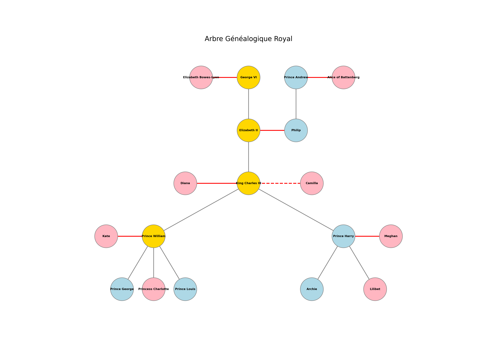

# graphe_robin_peigney
# 👑 Arbre Généalogique de la Famille Royale Britannique


Ce projet est un script Python qui génère une représentation visuelle de l'arbre généalogique de la famille royale britannique récente. Il utilise la théorie des graphes pour modéliser les liens de parenté, les mariages et les séparations.

## 📝 Description

Le script `famille_royale.py` crée un graphe orienté (Direct Graph) illustrant les relations entre les membres de la famille royale, allant de la génération du Roi George VI jusqu'aux enfants des Princes William et Harry. 

La visualisation distingue visuellement :
- Les lignées directes (rois, reines et héritiers directs de la couronne).
- Les genres (code couleur pour les hommes et les femmes).
- La nature des relations (filiation, mariage, divorce/séparation).

## ✨ Fonctionnalités

- **Positionnement manuel optimisé :** Les nœuds sont placés selon des coordonnées précises (`manual_pos`) pour garantir une lecture claire en forme d'arbre hiérarchique.
- **Code couleur sémantique :**
  - 🟡 **Doré :** Monarques et héritiers directs de la Couronne (ex: Elizabeth II, King Charles III, Prince William).
  - 🌸 **Rose :** Femmes.
  - 🧊 **Bleu clair :** Hommes.
- **Styles de liens détaillés :**
  - ➡️ **Flèches grises :** Liens de parenté (dirigés du parent vers l'enfant).
  - ➖ **Lignes rouges continues :** Mariages.
  - 🛑 **Lignes rouges pointillées :** Divorces ou mariages précédents.
- **Export automatique :** Génère et sauvegarde le graphe au format Haute Définition (`famille_royale.png`).

## 🛠️ Prérequis

Pour exécuter ce script, vous devez avoir **Python 3.x** installé sur votre machine, ainsi que les bibliothèques suivantes :

- `networkx` (pour la création et la gestion du graphe)
- `matplotlib` (pour le rendu visuel et graphique)

Vous pouvez installer les dépendances nécessaires via la commande suivante :

```bash
pip install networkx matplotlib
